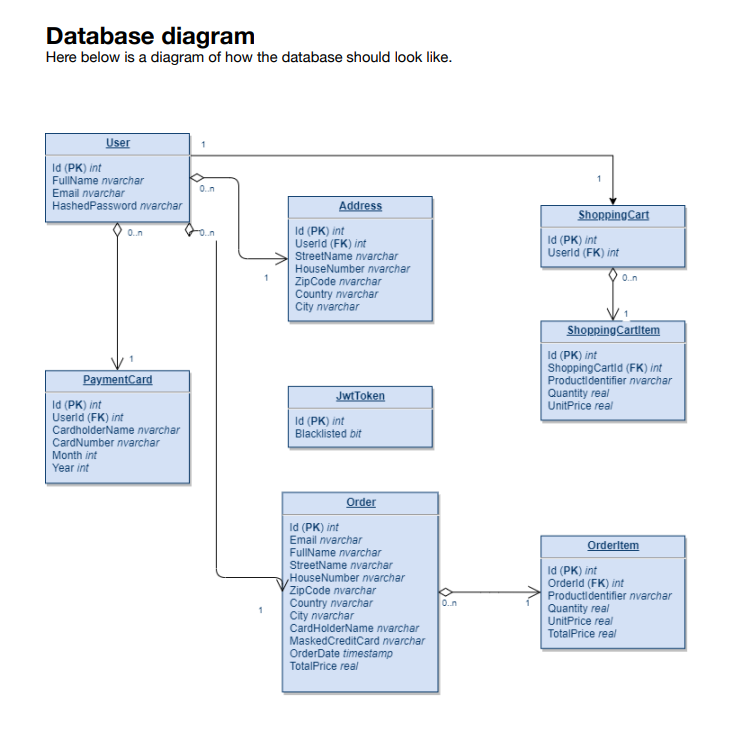
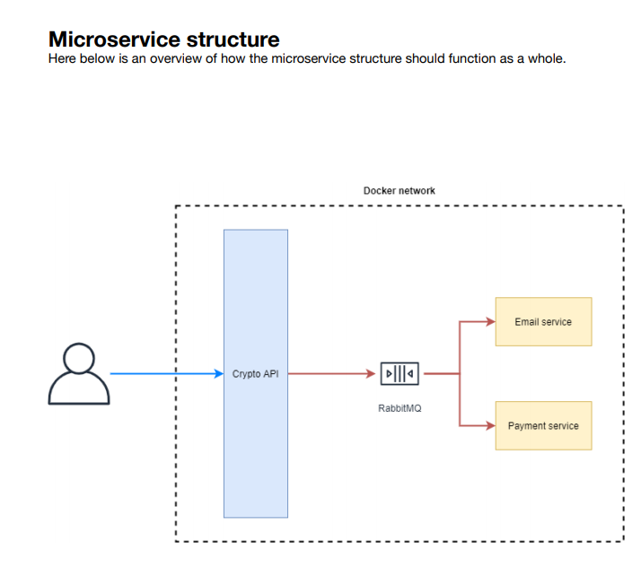

# How to use

(1) Start RabbitMq : with command rabbitmq-server OR start the file „RabbitMQ Service – start“
(2) Now you can start the .yml file run „docker-compose up“ in root directory to build/update and run the 3 services (Api, Payment, Email)

# Api

_Crypto currency api that uses external api to get lates prices, with register & signIn with JWT.  CRUD cart,users address, payments, orders.   
Microservices consists of four services   (1) Payment service written in python,  (2) Email service "recipt" written in python.  (3) API,  (4) RabbitMQ ("The glue between services").  
When you purchase currency the api will message rabbitMQ the information then the payment service will validate that the credit card is valid card and if so email the recipt._ 

## End Points

#### Authentication using JWT

##### AccountController

`/api/account/register [POST]` - Registers a user within the application, see Models section for reference 
`/api/account/signin [POST]` - Signs the user in by checking the credentials provided 
`/api/account/signout [GET]` - Logs the user out by voiding the provided JWT token using the id found within the claim 

#### Exchange

##### ExchangeController

`/api/exchanges [GET]` - Gets all exchanges in a paginated envelope. This routes accepts a single query parameter called pageNumber which is used to paginate the results 

##### CryptocurrencyController

`/api/cryptocurrencies [GET]` - Gets all available cryptocurrencies - the only available cryptocurrencies in this platform are BitCoin (BTC), Ethereum (ETH), Tether (USDT) and Monero (XMR) 

#### Shopping cart

##### ShoppingCartController

`/api/cart [GET]` - Gets all items within the shopping cart, see Models section for reference 
`/api/cart [POST]` - Adds an item to the shopping cart, see Models section for reference 
`/api/cart/{id} [DELETE]` - Deletes an item from the shopping cart 
`/api/cart/{id} [PATCH]` - Updates the quantity for a shopping cart item 
`/api/cart [DELETE]` - Clears the cart - all items within the cart should be deleted 

#### Address

##### AddressController

`/api/addresses [GET]` - Gets all addresses associated with authenticated user 
`/api/addresses [POST]` - Adds a new address associated with authenticated user, see Models section for reference 
`/api/addresses/{id} [DELETE]` - Deletes an address by id 

#### Payments

##### OrderController

`/api/payments [GET]` - Gets all payment cards associated with the authenticated user 
`/api/payments [POST]` - Adds a new payment card associated with the authenticated user, see Models section for reference 

#### Orders

##### PaymentController

`/api/orders [GET]` - Gets all orders associated with the authenticated user 
`/api/orders [POST]` - Adds a new order associated with the authenticated user, see Models section for reference 

## Database

- Navigate to https://www.elephantsql.com/ and register for a new PostgreSQL database
- Add the connection string to appsettings.json in the API project
- Setup a DbContext for the newly created database in the Repository project
- Register the DbContext within the API project
- Create your first migration and update the database according to those migrations (this can be repeated every time the entity models change)

 

## Payment service

- AMQP listener
- Sets up a queue called payment-queue which is bound to the create-order routing key
- Validate the credit card received within the order
- A third party tool to validate the credit card number
- Print out the validation message in the console

## Email service

- AMQP listener
- Sets up a queue called email-queue which is bound to the create-order routing key
- Send an email using Mailgun stating that the order was successful

## Diagram

## Service structure

